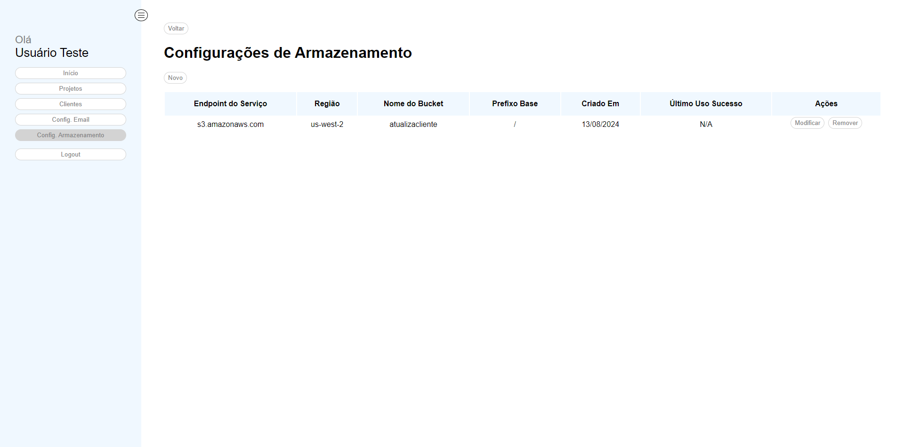
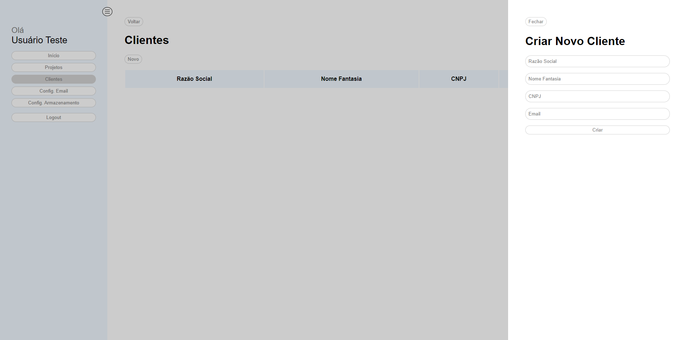

# Atualiza Cliente

Essa é uma plataforma opensource para registro de clientes e projetos, bem como suas atualizações ao longo do tempo e notificação dos clientes por e-mail.  

A implementação conta somente com o MVP do produto, não contemplando todas as validações e funcionalidades que podem existir, mas que permite forks do projeto para continuidade e implementação self-hosted.  

Apesar de existir endpoint para cadastro de usuários, o sistema não tem suporte visual a mais de um usuário, porém o banco de dados está preparado para isto. Além disso, o sistema foi pensado para solucionar o problema de um contexto somente, não permitindo várias empresas/pessoas lidando cada uma com seus clientes/projetos isoladamente como soluções SAAS disponíveis no mercado.

## Tencologia da Solução

O backend da solução foi escrito em Java 17 com framework Spring Boot, e teve suas entidades modeladas para utilização de banco PostgreSQL, como não conta com nenhuma consulta nativa, para utilizar outro banco de dados basta migrar o script de inicialização.  
[Backend](https://github.com/ricardoponcio/atualizacliente-api)

O frontend foi produzido com a biblioteca React.JS, sem uso de frameworks mais complexos.
[Frontend](https://github.com/ricardoponcio/atualizacliente-front)

A solução foi projetada para ser implementada da seguinte forma:

A recomendação seria o apontamento do DNS como registro A para um NGINX em uma máquina com IP quente, que faria o roteamento das requisições HTTPS com SSL engine + SSL Certbot para servidores que possuem o backend/frontend utilizando o protocolo HTTP. Também é recomendado uso de VPN para separação lógica dos recursos e dar mais segurança, removendo principalmente o banco de dados da máquina com ip quente.

## Recursos disponíveis

### 1. Setup do Usuário

Cadastro do usuário ao iniciar o sistema em um banco novo.

### 2. Login

Permite autenticar na plataforma utilizando as credenciais configuradas anteriormente no passo um.

### 3. Tela Inicial

Visualização das métricas dos projetos e primeiros dez projetos a vencer na sequência.

### 4. Configuração de E-mail

Recurso necessário para os avisos aos clientes.

*Por segurança, não é possível atualizar uma configuração (para evitar exposição das credenciais), portanto para atualizar basta remover o registro utilizando a ação correta e criar um novo.*

#### 4.1 Listagem das configurações

*Atualmente o sistema só permite cadastro de uma configuração para facilitar a seleção da configuração na hora de emitir os avisos*

#### 4.2 Criação de nova configuração

#### 4.2 Listagem de emails enviados

*Permite analisar erros na configuração do servidor de SMTP*

### 5. Configuração de Armazenamento

Recurso necessário para salvar os anexos, utiliza protocolo de armazenamento S3.

*Por segurança, não é possível atualizar uma configuração (para evitar exposição das credenciais), portanto para atualizar basta remover o registro utilizando a ação correta e criar um novo.*

#### 5.1 Listagem das configurações

*Atualmente o sistema só permite cadastro de uma configuração para facilitar a seleção da configuração na hora de anexar os documentos*

#### 5.2 Criação de nova configuração

### 6. Clientes

#### 6.1 Listagem dos clientes

#### 6.2 Criação de um novo registro

#### 6.3 Modificar um registro

#### 6.4 Validação do registro

*Ao ser cadastrado, o cliente recebe um e-mail com um link que leva a esta tela, nela ele deve criar uma senha de segurança para visualizar as atualizações e evitar vazamento dos dados*

#### 6.5 Remover um registro

### 7. Projetos

#### 7.1 Listagem dos projetos

#### 7.2 Criação de um novo registro

#### 7.3 Modificar um registro

*Modificar um projeto não emite atualização ao cliente, pois esse é um registro administrativo feito para auxiliar o usuário na organização.*

#### 7.4 Remover um registro

#### 7.5 Detalhar um Projeto

#### 7.6 Atualizações de Projeto

##### 7.6.1 Listagem dos projetos

A listagem pode ser feita ao detalhar um projeto, como mostrado no item 7.5.

##### 7.6.2 Emitir nova atualização

*A atualização inicia com os mesmos status/substatus do projeto no momento, e alterar estes valores ao emitir uma atualização, altera também os valores do projeto que está recebendo a atualização*

*Neste momento, ao salvar a atualização (descrição e anexos), será comunicado ao cliente de forma irreversível*

##### 7.6.4 Detalhar uma atualização emitida

##### 7.6.5 Consulta pública da atualização

*Tela será carregada ao abrir o link que será enviado para o usuário, será necessário informar a senha de segurança do cliente que foi cadastrado na validação para visualizar os dados*

